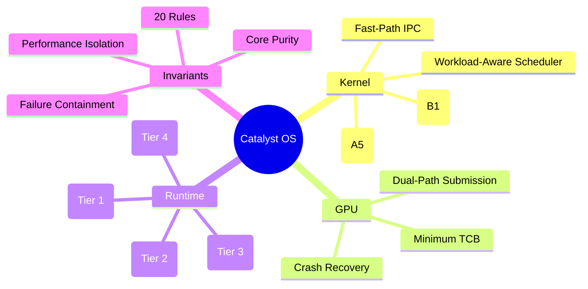

<!-- CATALYST OS — PROPRIETARY AND CONFIDENTIAL -->
<!-- Copyright (c) 2024-2026 Wahyu Nur Iman. All rights reserved. -->

# Catalyst OS

> **Efficient by default. Responsive by design. Power when you need it.**

A new general-purpose PC operating system built from first principles in Rust.

## Architecture



## Current Milestone

**M1: First Boot** — UEFI → Kernel → Serial Console → Banner → Halt

## Build

```bash
# Prerequisites
rustup default nightly
rustup component add rust-src llvm-tools

# Build kernel
cargo build -p catalyst-kernel

# Build boot image
cargo run -p catalyst-boot

# Boot in QEMU
powershell -File tools/run-qemu.ps1
```

## Architecture Documents

| Document | Description |
|----------|-------------|
| [Master Architecture](docs/MASTER_ARCHITECTURE_v0.2.md) | System layers and boundaries |
| [Kernel Specification](docs/KERNEL_SPEC_v0.2.md) | Kernel architecture evaluation |
| [Architectural Invariants](docs/ARCHITECTURAL_INVARIANTS_v0.2.md) | 20 non-negotiable rules |
| [Performance Contract](docs/PERFORMANCE_CONTRACT_v0.2.md) | Tiered benchmark targets |
| [Security Model](docs/SECURITY_MODEL_v0.2.md) | Capability-based security |
| [Filesystem Spec](docs/FILESYSTEM_SPEC_v0.2.md) | CatRAM → VFS → CatFS |
| [Compatibility Strategy](docs/COMPATIBILITY_STRATEGY_v0.2.md) | 5-tier runtime architecture |
| [Development Roadmap](docs/DEVELOPMENT_ROADMAP_v0.2.md) | M0–M17 milestones |
| [Test Strategy](docs/TEST_STRATEGY_v0.2.md) | Testing at every layer |
| [Risk Register](docs/RISK_REGISTER_v0.2.md) | 34 identified risks |
| [Decision Matrix](docs/ARCHITECTURE_DECISION_MATRIX_v0.1.md) | 10 formal architecture decisions |

## License

Proprietary. Copyright (c) 2024-2026 Wahyu Nur Iman. All rights reserved.
