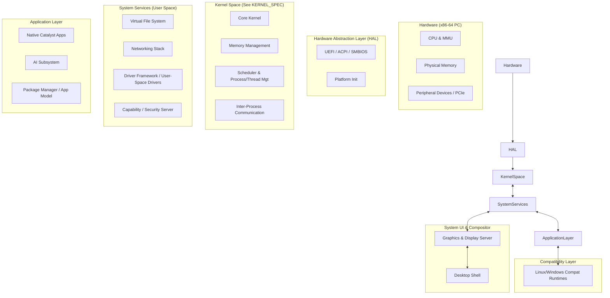

<!-- CATALYST OS — PROPRIETARY AND CONFIDENTIAL -->
<!-- Copyright (c) 2024-2026 Wahyu Nur Iman. All rights reserved. -->

# Catalyst OS Master Architecture v0.1

## 1. System Layer Diagram

## 2. Subsystem Boundaries

- **Boot:** Handles UEFI handover, system initialization, and ACPI parsing. Loads the kernel and initial ramdisk (initrd).
- **Kernel Core:** Minimal footprint. Manages interrupts, traps, and hardware initialization. See `KERNEL_SPEC` for structural details.
- **Memory Management:** Handles physical page allocation, virtual address spaces, and demand paging.
- **Process/Thread Management:** Tracks execution contexts, threads, and lifecycle states.
- **Scheduler:** Distributes CPU time among threads based on priority and capability, optimized for low latency and responsiveness.
- **IPC (Inter-Process Communication):** Fast, asynchronous message passing mechanism crucial for system service communication.
- **Syscall Interface:** Minimalistic set of system calls primarily focused on IPC, thread control, and memory manipulation.
- **VFS / Storage:** User-space server managing mount points, file metadata, and delegating actual I/O to storage drivers.
- **Networking:** Modular network stack providing socket interfaces and routing, operating primarily outside the kernel core.
- **Driver Framework:** Isolates hardware drivers in user space, communicating via IPC to prevent system crashes on driver failure.
- **HAL (Hardware Abstraction Layer):** Abstracts x86-64 specific quirks, providing a uniform interface for the rest of the OS.
- **Security/Capability Layer:** Implements capability-based security. Every action requires a capability, strictly controlled by a centralized server.
- **Graphics/Compositor:** Direct-to-buffer rendering server. Handles window composition and GPU acceleration.
- **Desktop Shell:** The primary user interface, distinct from the compositor, handling window management and user inputs.
- **Package/Application Model:** Containerized app distribution. Apps run in isolated sandboxes with declarative permissions.
- **Compatibility Runtimes:** Sandboxed environments executing foreign binaries (e.g., Linux ELF or Windows PE) by translating foreign syscalls to Catalyst IPC calls.
- **AI Subsystem:** On-device ML inference engine providing APIs for local text, image, and data processing.
- **Developer Platform:** SDKs, APIs, and debugging tools allowing native app development via Rust and standard C libraries.

## 3. Data Flows

- **I/O Flow:** Application -> IPC -> VFS Server -> IPC -> Storage Driver -> Hardware.
- **Network Flow:** Application -> Socket API (IPC) -> Network Server -> IPC -> NIC Driver -> Hardware.
- **Graphics Flow:** Application -> GPU Shared Memory -> IPC (Buffer Swap) -> Compositor -> Display Driver -> Hardware.
- **Event Flow:** Hardware Interrupt -> Kernel -> IPC -> Input Driver -> Compositor -> Shell/Application.

## 4. Security Boundaries

- **Kernel Mode vs. User Mode:** The strict separation enforced by CPU rings (Ring 0 vs. Ring 3).
- **Process Isolation:** Virtual memory boundaries prevent processes from reading or writing each other's memory.
- **Capability-Based Authorization:** No global root user. Rights are explicitly delegated via unforgeable capability tokens managed by the Security Server.
- **Driver Sandboxing:** Drivers execute in user mode with strictly limited IOMMU permissions and MMIO ranges.

## 5. Compatibility Boundaries

- Compatibility runtimes (e.g., POSIX/Linux, Win32) exist entirely in user space.
- They act as translation layers (similar to WSL1 or Wine) intercepting foreign system calls and converting them to native Catalyst IPC messages.
- The core OS does not include POSIX baggage; POSIX is strictly an optional compatibility module.

## 6. Key Architectural Properties

- **Efficiency & Gaming:** Direct GPU access via capability sharing minimizes latency. The scheduler prioritizes interactive and real-time tasks.
- **Immutable/Rollback-Capable:** The base OS image is read-only. Updates are A/B atomic images. User data is strictly separated.
- **Privacy-First, Secure by Architecture:** Capability-based security enforces the principle of least privilege at the architectural level.
- **AI-Native:** AI is a system service (like networking), running locally with hardware acceleration, not a bolted-on user app.
- **Modular:** The heavy use of user-space servers allows components (like the network stack or filesystem) to be updated or restarted without rebooting.

## 7. Architecture Decision Records (ADR)

### ADR-001: Separation of Compatibility from Core
- **Problem:** Existing OSes (like Linux) carry decades of legacy API baggage in the core kernel, complicating security and performance.
- **Options:** Native POSIX support in kernel vs. POSIX as a user-space compat layer.
- **Selected Approach:** POSIX and foreign APIs as user-space compatibility runtimes.
- **Reason:** Keeps the core Catalyst API minimal, fast, and modern.
- **Trade-offs:** Slight overhead when running legacy apps due to syscall translation.
- **Rejected Alternatives:** Monolithic POSIX kernel.

### ADR-002: Capability-Based Security Model
- **Problem:** Access Control Lists (ACLs) and "root" user models are prone to privilege escalation and confused deputy attacks.
- **Options:** ACLs, Role-Based Access Control (RBAC), Capability-Based Security.
- **Selected Approach:** Capability-Based Security.
- **Reason:** Provides fine-grained, verifiable, and inherently secure resource access.
- **Trade-offs:** Harder to implement and port existing software; requires a robust capability server.
- **Rejected Alternatives:** Traditional Unix UID/GID model.

### ADR-003: Immutable Base OS
- **Problem:** System bit-rot, broken updates, and malware modifying system binaries.
- **Options:** Read-write root filesystem vs. Immutable A/B image.
- **Selected Approach:** Immutable/rollback-capable system via A/B partitions.
- **Reason:** Guarantees a known-good state, trivial rollbacks, and high reliability.
- **Trade-offs:** Restricts traditional package managers (like apt/pacman) from freely modifying `/usr`. Requires containerized apps.
- **Rejected Alternatives:** Traditional mutable filesystem.
