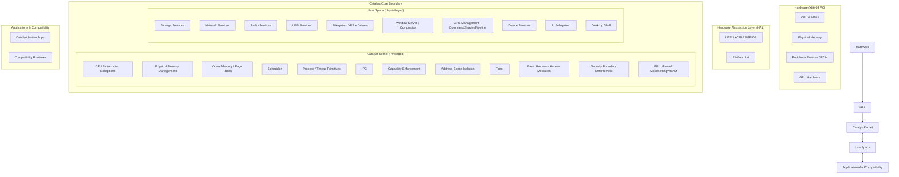

<!-- CATALYST OS — PROPRIETARY AND CONFIDENTIAL -->
<!-- Copyright (c) 2024-2026 Wahyu Nur Iman. All rights reserved. -->

# Catalyst OS Master Architecture v0.2

## 1. System Layer Diagram



## 2. Catalyst Core Boundary

The architecture enforces a strict boundary between privileged kernel operations and unprivileged user-space services. The exact kernel architecture is UNDER EVALUATION by KERNEL_SPEC_v0.2. This document defines the SYSTEM architecture.

### CATALYST KERNEL (privileged)
- CPU / interrupt / exception
- Physical memory management
- Virtual memory / page tables
- Scheduler
- Process / thread primitives
- IPC
- Capability enforcement
- Address-space isolation
- Timer
- Basic hardware access mediation
- Security boundary enforcement

### USER SPACE (unprivileged)
- Storage services
- Network services
- Audio services
- USB services
- Filesystem (VFS + drivers)
- Window server / compositor
- GPU management (most of it)
- Device services
- Compatibility runtimes
- AI subsystem
- Desktop shell

## 3. GPU Architecture

The GPU employs a SPLIT architecture to minimize the privileged attack surface. We do not place the entire GPU stack in either kernel or user space.

- **Kernel-Space (Minimal Privilege):** Handles modesetting, VRAM page table management, and interrupt handling.
- **User-Space (Bulk of Complexity):** Handles command submission, shader management, and the rendering pipeline.

## 4. Compatibility Boundaries

Compatibility runtimes are explicitly OUTSIDE the Catalyst Core.

```text
             Catalyst Core
                  │
    ┌─────────────┼─────────────┐
    ↓             ↓             ↓
Catalyst       Windows       Android
 Native        Runtime        Runtime
    │             │             │
    └─────────────┼─────────────┘
                  ↓
            Catalyst APIs
                  ↓
            Catalyst Kernel
```

- Compatibility runtimes act as translation layers, intercepting foreign system calls and converting them to native Catalyst IPC messages.
- The core OS does not include POSIX or legacy baggage; these are strictly optional user-space modules.

## 5. Data Flows

- **I/O Flow:** Application -> IPC -> VFS Server -> IPC -> Storage Driver -> Hardware.
- **Network Flow:** Application -> Socket API (IPC) -> Network Server -> IPC -> NIC Driver -> Hardware.
- **Graphics Flow:** Application -> GPU User-Space Driver -> IPC -> Compositor -> GPU Kernel Driver -> Hardware.
- **Event Flow:** Hardware Interrupt -> Kernel -> IPC -> Input Driver -> Compositor -> Shell/Application.

## 6. Architecture Decision Records (ADR)

### ADR-001: Separation of Compatibility from Core
- **Problem:** Existing OSes carry decades of legacy API baggage in the core kernel, complicating security and performance.
- **Options:** Native POSIX support in kernel vs. POSIX as a user-space compat layer.
- **Selected Approach:** Compatibility runtimes (Windows, Linux, Android) exist entirely in user space, mapping to native Catalyst APIs.
- **Reason:** Keeps the core Catalyst API minimal, fast, and modern without polluting the architectural boundaries.
- **Trade-offs:** Slight overhead when running legacy apps due to syscall translation.

### ADR-002: Capability-Based Security Model
- **Problem:** Access Control Lists (ACLs) and "root" user models are prone to privilege escalation and confused deputy attacks.
- **Selected Approach:** Capability-Based Security in the kernel IPC layer.
- **Reason:** Provides fine-grained, verifiable, and inherently secure resource access.

### ADR-003: Immutable Base OS
- **Problem:** System bit-rot, broken updates, and malware modifying system binaries.
- **Selected Approach:** Immutable/rollback-capable system via A/B partitions.
- **Reason:** Guarantees a known-good state, trivial rollbacks, and high reliability.

### ADR-004: GPU Architecture Split Privilege
- **Problem:** GPU drivers are massive, complex codebases (often millions of lines of code) that historically run entirely in Ring 0, leading to severe stability and security issues.
- **Options:** Full kernel-space GPU driver vs. Full user-space GPU driver vs. Split privilege.
- **Selected Approach:** Split architecture. Minimal kernel component (modesetting, VRAM management) and a complex user-space component (command submission, shaders).
- **Reason:** Minimizes the trusted computing base (TCB) in the kernel while maintaining necessary hardware mediation.

### ADR-005: User-Space System Services
- **Problem:** Monolithic kernels house networking, storage, and device drivers in kernel space, causing a single driver crash to panic the entire system.
- **Options:** Kernel-space services vs. User-space system services.
- **Selected Approach:** All non-essential services (storage, network, audio, USB, AI, VFS) run in unprivileged user space. Exception policy applies only to minimal hardware mediation strictly requiring Ring 0.
- **Reason:** Massively improves system stability, fault isolation, and the ability to update services without rebooting.
