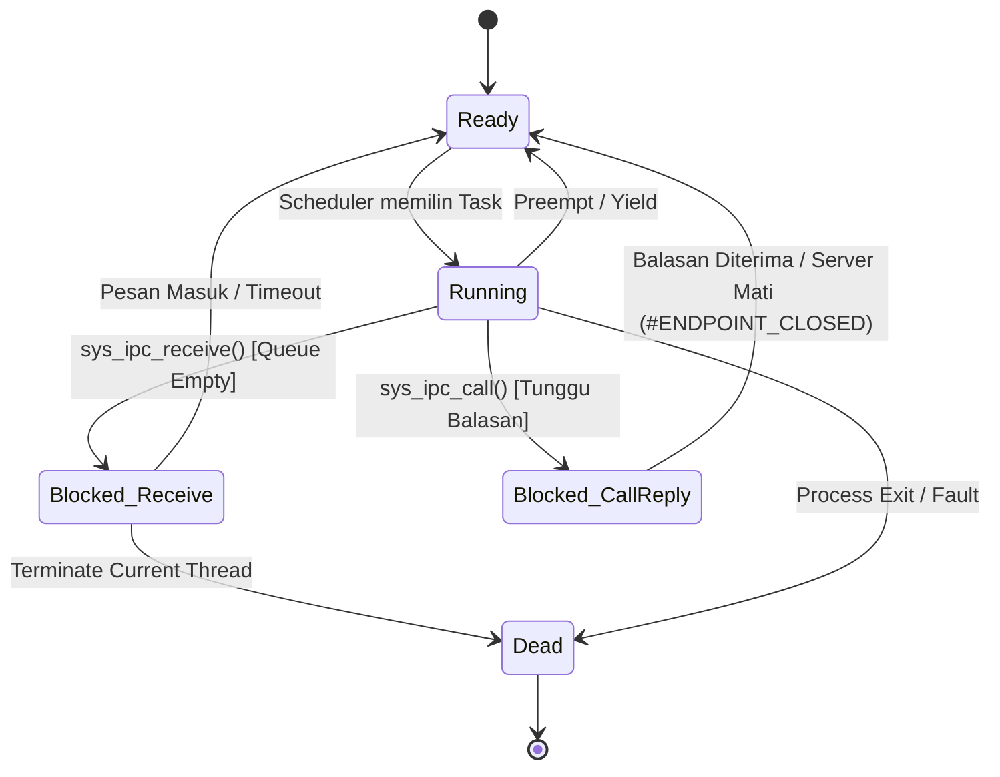

# CatalystOS Phase 4 Architecture: IPC & Userspace Service Foundation

## 1. Philosophy & Goals
Phase 4 menandai transisi CatalystOS dari kernel pengeksekusi proses primitif menjadi sebuah **microkernel sejati**. Kernel tidak akan menyediakan *service logic* (seperti file system, network stack, atau GUI). Kernel secara eksklusif hanya menyediakan **mekanisme** (*mechanism*), sementara **kebijakan** (*policy*) dan logika layanan bergeser ke ranah *Userspace Services*.

Fondasi utama dari transisi ini adalah **Inter-Process Communication (IPC)** berbasis pesan sinkron, dibungkus dalam model keamanan **Capability**.

---

## 2. IPC Primitives & Message Ownership
IPC CatalystOS menggunakan model *Synchronous Message Passing* dasar.
- `send(endpoint, message)`: Mengirim pesan ke endpoint.
- `receive(endpoint, message_buffer)`: Menunggu dan membaca pesan dari endpoint.
- `call(endpoint, request, reply_buffer)`: Gabungan `send` dan `receive` yang tersinkronisasi khusus untuk RPC.

**Message Ownership & Bounded Rules:**
Tidak ada *userspace pointer* arbitrer yang diizinkan untuk "hidup" di dalam *message queue* kernel. Semantik pengiriman harus murni *copy-in / copy-out*:
1. `send()` dipanggil.
2. Kernel menyalin pesan ke dalam buffer IPC kernel internal yang terbatas (maksimal **`256 bytes`**).
3. `receive()` dipanggil.
4. Receiver menyalin data keluar dari buffer kernel.

Selain pembatasan ukuran pesan (256 bytes), kedalaman antrean juga dibatasi absolut ke **`64 messages`** per Endpoint.

---

## 3. Endpoints & Generational Identity
Endpoint memberikan lapisan abstraksi agar identitas tidak secara langsung dikaitkan dengan struktur memori/PID. Untuk mencegah masalah objek lama yang tertunjuk ulang (dangling/reused), identitas menggunakan model *generational*.

```rust
pub struct EndpointId {
    pub index: u32,
    pub generation: u32,
}

pub struct Endpoint {
    pub id: EndpointId,
    pub owner: u64, // ProcessId dari pemilik
    pub queue: MessageQueue,
    pub state: EndpointState,
}

pub enum EndpointState {
    Active,
    Closed,
}
```

---

## 4. Capability Security Model (Non-Forgery)
Akses ke *Endpoint* **dilarang secara default**. Ring 3 tidak dapat memalsukan hak akses dengan menebak integer. Sistem menggunakan konsep **Capability Table** internal per-proses. *Userspace* hanya memegang `CapabilityHandle` (index lokal).

```rust
// Hanya hidup di dalam kernel
pub struct Capability {
    pub endpoint: EndpointId, // Termasuk generation validation
    pub rights: CapRights,
}

bitflags! {
    pub struct CapRights: u8 {
        const SEND    = 1 << 0;
        const RECEIVE = 1 << 1;
        const CALL    = 1 << 2;
    }
}
```
Alur syscall akan memvalidasi: `CapabilityHandle -> Thread Capability Table -> Endpoint + Generation + Rights`.

---

## 5. Blocking, Scheduler Integration & Atomic Transitions
Sistem IPC terintegrasi langsung dengan *Scheduler* melalui status `Blocked` yang lebih spesifik, memudahkan pelacakan *reason* dan eksekusi.

```rust
pub enum TaskState {
    Ready,
    Running,
    Blocked(BlockReason),
    Dead,
}

pub enum BlockReason {
    Receive(EndpointId),
    CallReply(EndpointId),
    Sleep,
}
```

**Atomic Wait/Wakeup (C13):**
Untuk mencegah *Lost Wakeup*, operasi pendaftaran *waiter*, pemeriksaan *queue*, dan transisi status `Blocked` harus dilakukan di dalam satu *critical section* yang sama.

### State Transition Diagram (IPC ↔ Scheduler)


---

## 6. Timeout Semantics
Semua pemanggilan blocking harus memiliki primitif *timeout* (`sys_ipc_receive_timeout`, `sys_ipc_call_timeout`) untuk mencegah *deadlock* saat layanan mogok atau hang. Timeout mengubah `Blocked` menjadi `Ready` dengan *return code* `TIMEOUT`.

---

## 7. Process Death & Cleanup (No Permanent Wait)
Matinya sebuah server atau klien harus memicu *Garbage Collection* deterministik:
1. Status *Endpoint* milik proses mati diubah menjadi `Closed`.
2. Pesan tertunda di `queue` dibuang.
3. Seluruh kapabilitas klien menuju *Endpoint* tersebut dicabut.
4. **No Permanent IPC Wait (C14):** Jika *Process A* sedang *Blocked* menunggu *reply* dari `CALL` kepada server, dan server itu mati, `Process A` harus dibangunkan seketika dengan status `#ENDPOINT_CLOSED`.

---

## 8. Shared Memory Primitives
*Shared memory* digunakan murni sebagai utilitas pengiriman bongkahan data besar (contoh: framebuffer), bukan IPC Universal (zero-copy VFS tidak akan menumpang sistem ini secara otomatis).
- Akses diizinkan melalui *explicit kernel-mediated mapping*.
- Tidak ada *implicit shared memory* antar *Address Space*.
- Harus dilampiri *permission* spesifik (`READ`, `WRITE`).

---

## 9. Syscall ABI Layering
Menjaga ABI agar tetap evolusioner, aplikasi *userspace* tidak akan memanggil *register* mentah.
1. **Userspace IPC Library** (`libcatalyst::ipc::send()`)
2. **Hardware Syscall ABI** (`int 0x80` / `syscall` interface)
3. **Kernel Dispatcher** (Mengarahkan index ke fungsi rust di kernel)
4. **Kernel IPC Primitive** (Eksekusi validasi capability & transfer pesan)

---

## 10. IPC Priority Semantics
Pada fase ini (V1), **Priority Inversion dideklarasikan sebagai fitur terisolasi yang diakui ketiadaannya (limitation)**. *Priority Inheritance* otomatis tidak diimplementasikan pada Fase 4 untuk menghindari kompleksitas algoritma loker, melainkan akan didokumentasikan dan direncanakan sebagai *enhancement* mendatang.

---

## 11. Architectural Invariants (C1-C16)

| ID  | Invariant | Penjelasan |
|-----|-----------|------------|
| C1  | Endpoint identity tidak dangling | Endpoint harus hancur secara terprediksi saat owner mati (Generational ID). |
| C2  | Message size bounded | Maksimal 256 bytes per pesan (Pure copy-in/copy-out). |
| C3  | Queue depth bounded | Maksimal 64 pesan per endpoint. |
| C4  | Capability diperlukan untuk akses | Blokir komunikasi tanpa kapabilitas eksplisit di `CapabilityTable`. |
| C5  | Capability rights ditegakkan | `SEND`, `RECEIVE`, `CALL` divalidasi presisi. |
| C6  | Blocking terintegrasi scheduler | Sinkronisasi `TaskState::Blocked(BlockReason)` dan `TaskState::Ready`. |
| C7  | Wake-up tidak boleh kehilangan event | *Lost wakeup* nihil via aturan C13. |
| C8  | Process death membersihkan aset | GC otomatis atas endpoint, antrean, dan kapabilitas proses yang mati. |
| C9  | Tiada kernel-memory disclosure | Memori pesan dikelola via kernel buffer dan disalin keluar dengan aman. |
| C10 | Explicit shared-memory mapping | Hak `READ`/`WRITE` dibagikan via mekanisme *explicit grant*. |
| C11 | Kernel mechanism-only | Kernel tidak tahu menahu soal `File`, `Window`, murni *scheduler* & IPC. |
| **C12** | **Capability non-forgery** | Identitas objek divalidasi via *CapabilityTable* (Handle index), mencegah *userspace* memalsukan integritas integer. |
| **C13** | **Atomic wait/wakeup transition** | Pendaftaran *waiter*, pemeriksaan *queue*, dan keputusan *blocking* harus berada dalam 1 *critical section*. |
| **C14** | **No permanent IPC wait** | Thread tidak boleh terjebak saat `CALL` / `RECEIVE` terhadap *server* yang mati mendadak; wajib dibangunkan via `#ENDPOINT_CLOSED`. |
| **C15** | **No implicit shared memory** | Tidak ada partisi *physical frame* yang dapat dibagikan otomatis tanpa mediasi kernel/mekanisme grant secara sadar. |
| **C16** | **IPC priority semantics** | Modifikasi prioritas tidak diturunkan ke server secara implisit di V1; *Priority inversion* didokumentasikan. |
